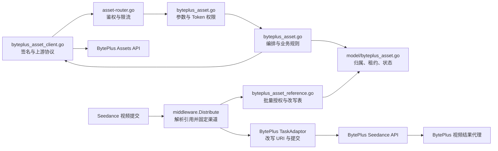
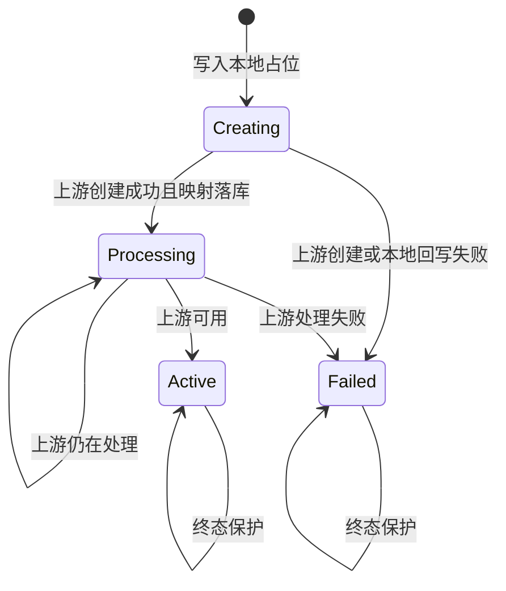
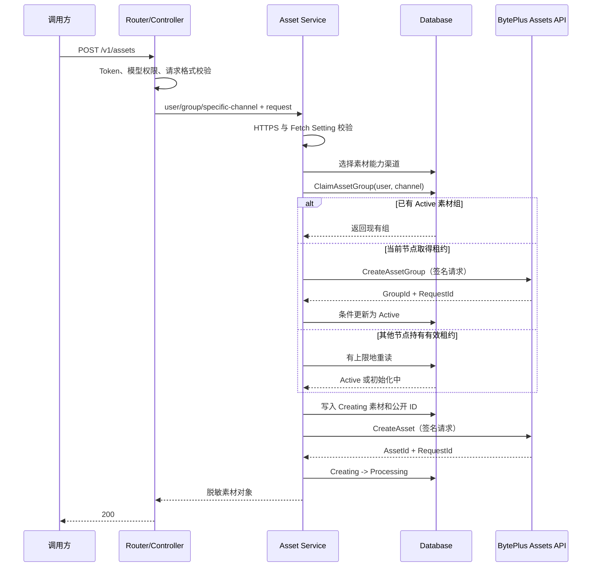
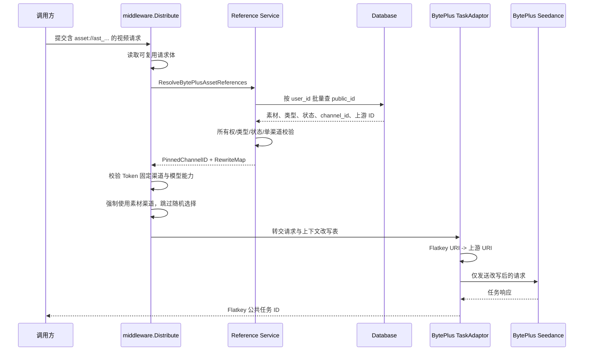

# BytePlus 素材库功能架构设计

> 状态：已实现并完成正式环境端到端验证<br>
> 初始设计日期：2026-07-29<br>
> 最近更新：2026-07-30<br>
> 适用范围：Flatkey / New API 的 BytePlus 素材创建、查询与 `asset://` 引用链路<br>
> API 说明：[BytePlus 素材库 API 文档](../../api/byteplus-asset-api.md)

## 1. 文档目的

本文是 BytePlus 素材库功能的架构与实现边界说明。它描述素材如何创建、持久化、查询、鉴权，并在 `seedance-2.0` 视频请求中被安全引用。

本文不扩展为通用 Seedance 视频架构，也不重复完整的调用参数、响应字段和 SDK 示例；调用方应同时阅读独立的 API 文档。

## 2. 背景、目标与范围

### 2.1 背景

Flatkey 已通过现有 BytePlus 渠道提供 Seedance 视频任务能力。BytePlus 素材库需要使用同一上游账号和项目创建素材，并确保后续视频任务仍路由到创建素材的上游渠道。若素材创建和视频生成落到不同 BytePlus 账号，即使模型相同，上游也无法识别该素材。

因此，素材库不能只做一个上游 API 代理。它必须同时解决：

- Flatkey 用户与上游素材之间的所有权映射；
- 上游 `GroupId`、`AssetId` 和凭据的隐藏；
- 多节点部署下素材组唯一创建与失败恢复；
- 视频分发前的素材归属、类型、状态和渠道校验；
- 素材渠道固定以及适配器内的 URI 改写；
- 旧 BytePlus 纯字符串 API Key 和普通视频请求兼容。

### 2.2 目标

1. 复用现有 `ChannelTypeBytePlus` 的配置、启停、分组和模型能力。
2. 为调用方提供稳定的 Flatkey 素材 ID，不暴露上游素材标识。
3. 每个素材始终归属于创建它的 Flatkey 用户和 BytePlus 渠道。
4. 视频提交前完成素材授权，并强制路由到素材所属渠道。
5. 使用数据库租约和条件更新支持生产多节点部署。
6. 对凭据、源 URL、上游 ID 和错误正文实施最小暴露。
7. 不改变不含素材引用的现有 Seedance 视频链路。

### 2.3 本期包含

- 内部创建或复用用户在某个 BytePlus 渠道下的素材组；
- `POST /v1/assets` 创建 `Image`、`Video`、`Audio` 素材；
- `GET /v1/assets/:asset_id` 查询并同步素材状态；
- `Moderation.Strategy` 的 `Default` 和 `Skip`；
- 严格格式的 `asset://ast_<32-character-id>`；
- `seedance-2.0` 视频请求中的图片、视频和音频素材引用；
- 用户所有权、媒体类型、素材状态和单渠道一致性校验；
- BytePlus 渠道固定、上游素材 URI 改写和视频结果代理；
- 结构化渠道凭据和旧纯字符串 API Key 的兼容读取；
- 数据库迁移、多节点租约、终态保护和安全错误模型。

### 2.4 非目标

- 不新增素材专用渠道类型；
- 不向调用方开放素材组 CRUD、列表或删除接口；
- 不暴露或允许调用方提交上游 `GroupId`、`AssetId`、`ProjectName` 或渠道 ID；
- 不支持调用方自带 BytePlus AK/SK；
- 不允许共享上游账号的用户直接在 BytePlus 控制台创建素材后绕过 Flatkey 所有权登记；
- 不改变视频 Content Pre-filter；素材创建的 Moderation 与视频 Content Pre-filter 是两套机制；
- 不承诺在不同 BytePlus 账号、项目或渠道之间迁移或复用素材；
- 不把本设计扩展为 `seedance-2.0-fast`、`seedance-2.0-mini` 或其他模型的通用素材协议。

## 3. 架构原则与关键决策

### 3.1 复用现有 BytePlus 渠道

素材凭据和视频 API Key 都保存在现有 BytePlus 渠道的 `Channel.Key` 中。素材组绑定具体渠道，素材继承素材组渠道，引用素材的视频请求再固定到该渠道。

选择该方案的理由：

- 凭据、模型能力、用户分组、渠道启停和并发额度保持同一生命周期；
- 同一部署可配置多个 BytePlus 账号或项目并进行故障隔离；
- 不复制一套素材专用的渠道管理和运维协议；
- `Channel.Key` 已有后台隐藏边界，而 `OtherSettings` 会作为设置数据返回前端，不适合保存 AK/SK。

### 3.2 Flatkey ID 是唯一外部标识

调用方只接触 `ast_` 前缀的随机 ID。数据库保存 `public_id -> upstream_asset_id` 映射，上游 ID 只在服务层、BytePlus Client 和请求上下文的改写表中流动。

素材 URI 的完整正则为：

```text
^asset://(ast_[A-Za-z0-9]{32})$
```

不允许空格、查询参数、片段、路径后缀或短 ID。普通 HTTPS URL 不受影响；媒体 URL 字段中任何以 `asset:` 开头但不满足严格格式的值都会被拒绝。

### 3.3 授权先于路由

`middleware.Distribute()` 在随机选择渠道之前读取可复用请求体并解析素材引用。只有完成所有权、类型、状态和跨渠道检查后，才把素材所属渠道设置为本次请求的强制渠道。

这是一条安全不变量：**带素材引用的视频请求不得先随机选渠道，也不得在失败后静默切换渠道。**

### 3.4 数据库是多节点协调源

素材组创建权由唯一索引、数据库租约和带旧租约值的条件更新决定。进程锁和内存状态不能作为正确性基础。

### 3.5 兼容优先、能力渐进启用

旧渠道的纯字符串 `Channel.Key` 继续作为视频 API Key 使用。不完整的结构化凭据或旧字符串凭据不能创建素材，但仍可处理不含 Flatkey 素材引用的普通视频请求。

## 4. 组件架构



### 4.1 Router

实现文件：`router/asset-router.go`

职责：

- 注册 `POST /v1/assets` 和 `GET /v1/assets/:asset_id`；
- 应用 `RouteTag("asset")`、全局 API 限流、Token 鉴权和模型请求限流；
- 不挂载普通视频的 `Distribute()`，因为素材创建需要在 Service 内选择具备素材凭据的 BytePlus 渠道。

### 4.2 Controller

实现文件：`controller/byteplus_asset.go`

职责：

- 解析 JSON 和路径参数；
- 读取 Token 的用户、用户组、使用组和固定渠道约束；
- 要求 Token 有权使用 `seedance-2.0`；
- 将内部错误转换为稳定的 OpenAI 兼容错误结构和国际化文案；
- 确保响应不附带内部错误元数据。

### 4.3 Service

主要文件：

- `service/byteplus_asset.go`
- `service/byteplus_asset_reference.go`
- `service/byteplus_credentials.go`

职责：

- 校验素材请求和源 URL；
- 选择支持素材能力的 BytePlus 渠道；
- 创建或复用素材组；
- 生成不可预测的 Flatkey 素材 ID；
- 编排上游创建、状态查询和本地持久化；
- 从视频 `content[]` 中提取素材 URI；
- 批量执行用户所有权、媒体类型、状态和渠道一致性校验；
- 生成仅在请求上下文中存在的 URI 改写表。

### 4.4 Model

实现文件：`model/byteplus_asset.go`

职责：

- 保存素材组、素材、渠道归属和上游映射；
- 使用唯一索引和条件更新分配素材组创建租约；
- 使用 `lease_updated_time` 防止旧节点覆盖新租约结果；
- 使用终态保护避免 `Active` 或 `Failed` 被迟到轮询回写。

### 4.5 BytePlus Client

实现文件：`service/byteplus_asset_client.go`

职责：

- 封装 `CreateAssetGroup`、`CreateAsset`、`GetAsset`；
- 构造固定版本、区域和服务名的 BytePlus 请求；
- 使用共享的火山引擎签名器；
- 限制请求时长和响应体大小；
- 验证响应 ID、状态和错误 envelope；
- 只向上层返回脱敏错误和必要的 Request ID。

### 4.6 BytePlus TaskAdaptor 与视频代理

主要文件：

- `relay/channel/task/byteplus/adaptor.go`
- `relay/channel/task/byteplus/constants.go`
- `controller/video_proxy_byteplus.go`

BytePlus 使用独立 `TaskAdaptor`。它可以嵌入并复用 Doubao 的协议兼容实现，但 BytePlus 的鉴权头、Moderation Header、素材 URI 改写、任务响应脱敏和视频结果提取保持独立边界。

## 5. 对外接口边界

详细参数、响应、调用示例和轮询建议见 [BytePlus 素材库 API 文档](../../api/byteplus-asset-api.md)。本节只描述架构约束。

### 5.1 创建素材

```http
POST /v1/assets
Authorization: Bearer <flatkey-api-key>
Content-Type: application/json
```

```json
{
  "url": "https://example.com/reference.mp4",
  "asset_type": "Video",
  "moderation": {
    "strategy": "Default"
  }
}
```

约束：

- `url` 必须是无用户信息的绝对 HTTPS 公网地址；
- URL 还必须通过系统统一的域名、IP 和端口过滤规则；
- Flatkey 不下载素材内容，只把 URL 传给 BytePlus；
- `asset_type` 只允许 `Image`、`Video`、`Audio`；
- Moderation 缺省为 `Default`，只允许 `Default` 或 `Skip`；
- 调用方不能指定素材组、上游素材 ID、项目或渠道；
- 成功响应只返回 Flatkey 素材对象。

### 5.2 查询素材

```http
GET /v1/assets/ast_<32-character-id>
Authorization: Bearer <flatkey-api-key>
```

查询流程始终带当前 `user_id` 条件。不存在和不属于当前用户使用相同的 404 语义，避免枚举他人素材。

对本地 `Processing` 素材，服务调用绑定渠道的 `GetAsset` 并同步状态。`Active` 和 `Failed` 是受保护终态，不允许迟到响应反向覆盖。

### 5.3 在视频中引用素材

```json
{
  "model": "seedance-2.0",
  "content": [
    {
      "type": "image_url",
      "image_url": {
        "url": "asset://ast_<32-character-id>"
      },
      "role": "reference_image"
    }
  ]
}
```

图片字段只能引用 `Image`，视频字段只能引用 `Video`，音频字段只能引用 `Audio`。校验依据是实际填充的媒体字段，而不是仅信任调用方传入的 `type` 文本。

## 6. 凭据模型与安全边界

### 6.1 兼容格式

旧渠道继续支持纯字符串视频 API Key：

```text
<byteplus-video-api-key>
```

启用素材能力的渠道使用结构化 JSON：

```json
{
  "api_key": "<byteplus-video-api-key>",
  "access_key_id": "<byteplus-access-key-id>",
  "secret_access_key": "<byteplus-secret-access-key>",
  "project_name": "<byteplus-project-name>"
}
```

解析规则：

- 非 JSON 字符串按旧 `api_key` 处理；
- 以 `{` 开头的值必须按结构化凭据严格解析；
- JSON 格式错误或字段类型错误时返回配置错误，不得把整段 JSON 当作 Bearer Token；
- 视频提交和任务轮询只使用解析后的 `api_key`；
- 素材 API 必须同时具备四个字段；
- 凭据只保存在 `Channel.Key`，不写入 `OtherSettings`。

### 6.2 信任边界

| 边界 | 可见数据 | 禁止暴露 |
| --- | --- | --- |
| 调用方 ↔ Flatkey | Flatkey Token、公开素材 ID、公开状态 | 上游 ID、渠道 ID、项目名、上游凭据 |
| Controller ↔ Service | 用户、Token 约束、经过解析的请求 | 原始响应体和签名细节 |
| Service ↔ Model | 用户/渠道归属、上游映射、脱敏错误 | 源 URL 持久化、任何凭据 |
| Service ↔ BytePlus Client | 内存中的结构化凭据、上游 ID | 写日志、写 API 响应 |
| Distributor ↔ TaskAdaptor | 固定渠道 ID、临时 URI 改写表 | 向调用方回显改写表 |

### 6.3 源 URL 与 SSRF 防护

虽然 Flatkey 不主动抓取素材 URL，仍在提交给上游前执行统一 URL 安全校验：

- 只允许 HTTPS；
- 禁止 URL userinfo；
- 禁止 localhost；
- 使用系统 Fetch Setting 的域名、IP、端口过滤；
- 不把完整源 URL持久化到数据库；`SourceURL` 明确标记为 `gorm:"-"`；
- 日志不得记录含查询参数的完整源 URL。

## 7. 数据模型

### 7.1 `BytePlusAssetGroup`

素材组是内部实体，不提供外部路由。

| 字段 | 用途 | 外部可见 |
| --- | --- | --- |
| `id` | 本地主键 | 否 |
| `user_id` | Flatkey 所有者 | 否 |
| `channel_id` | 绑定 BytePlus 渠道 | 否 |
| `upstream_group_id` | BytePlus GroupId | 否 |
| `upstream_request_id` | 运维关联 Request ID | 否 |
| `status` | `Creating` / `Active` / `Failed` | 否 |
| `error_message` | 脱敏错误 | 否 |
| `lease_updated_time` | 创建租约版本和超时判断 | 否 |
| `created_time` / `updated_time` | Unix 时间 | 否 |

`(user_id, channel_id)` 有唯一索引，因此同一用户可以在不同 BytePlus 渠道各有一个素材组，但不能在同一渠道重复创建本地组记录。

### 7.2 `BytePlusAsset`

| 字段 | 用途 | 外部可见 |
| --- | --- | --- |
| `id` | 本地主键 | 否 |
| `public_id` | `ast_` + 32 位密码学随机字符 | 是 |
| `user_id` | Flatkey 所有者 | 否 |
| `asset_group_id` | 本地素材组 | 否 |
| `channel_id` | 固定渠道冗余字段 | 否 |
| `upstream_asset_id` | BytePlus AssetId | 否 |
| `upstream_request_id` | 运维关联 Request ID | 否 |
| `asset_type` | `Image` / `Video` / `Audio` | 是 |
| `moderation_strategy` | `Default` / `Skip` | 是 |
| `status` | 素材状态 | 是 |
| `error_message` | 脱敏错误 | 否 |
| `created_time` / `updated_time` | Unix 时间 | 创建时间可见 |

`public_id` 有唯一索引，所有按公开 ID 的业务查询都同时带 `user_id`。`source_url` 仅作为内存字段存在，不落库。

### 7.3 状态机



状态语义：

- `Creating`：本地记录已建立，但上游 ID 尚未可靠持久化；
- `Processing`：上游已接受创建，可查询进度但不能用于视频；
- `Active`：可用于视频引用；
- `Failed`：不可恢复的当前素材记录终态，调用方需要重新创建素材。

## 8. 核心调用流程

### 8.1 创建素材



关键失败边界：

- 上游创建素材失败：本地素材转为 `Failed`；
- 上游创建成功但本地映射持久化失败：记录受限日志并返回存储错误，不伪报成功；
- 上游创建组成功但本地激活失败：可能产生孤立上游组，只能依靠 Request ID 运维定位；
- 当前版本没有自动删除或幂等查询上游孤立组的能力。

### 8.2 查询并同步状态

1. 以 `(user_id, public_id)` 查询本地素材。
2. `Creating` 返回 409，`Failed` 返回 422。
3. 加载记录绑定的 BytePlus 渠道和结构化凭据。
4. 使用本地保存的上游 ID 调用 `GetAsset`。
5. 验证响应 ID 与请求 ID 一致，只接受已知状态。
6. 以条件更新写入状态；终态记录不被覆盖。
7. 再次按用户读取本地记录并返回脱敏对象。

### 8.3 视频引用、授权、固定路由与改写



授权与路由顺序：

1. 扫描 `content[]` 实际存在的 `image_url`、`video_url`、`audio_url`；
2. 严格解析 Flatkey 素材 URI，并对重复引用去重；
3. 用当前用户和公开 ID 批量查询；
4. 缺失或跨用户统一返回 404；
5. 在逐项状态和类型校验前先检查跨渠道冲突，使错误语义稳定；
6. 校验媒体字段与素材类型匹配；
7. 只允许 `Active` 且有上游 ID 的素材；
8. 要求所有素材绑定同一个正整数渠道 ID；
9. 校验渠道仍启用、类型为 BytePlus、对当前组和模型可用；
10. 若 Token 固定渠道，必须与素材渠道一致；
11. 将固定渠道和 URI 改写表写入当前 Gin Context；
12. `TaskAdaptor` 在序列化后的上游请求体中完成精确替换；
13. 改写表缺失或 URI 非严格格式时拒绝提交，不原样透传给上游。

## 9. 多节点并发、租约与失败恢复

### 9.1 素材组唯一创建

`ClaimBytePlusAssetGroup()` 首先尝试 `INSERT ... ON CONFLICT DO NOTHING`。插入成功的节点取得租约；插入失败的节点读取已有记录。

可取得或接管创建权的条件：

- 当前没有 `(user_id, channel_id)` 记录；
- 现有记录为 `Failed`；
- 现有记录为 `Creating`，且 `lease_updated_time` 早于 300 秒恢复阈值。

其他节点遇到有效 `Creating` 租约时进行 3 次有上限的短暂重读。若仍未变为 `Active`，返回 `asset_group_initializing`，由客户端稍后重试。

### 9.2 租约防陈旧写

`ActivateBytePlusAssetGroup()` 和 `FailBytePlusAssetGroup()` 的更新条件同时包含：

- 本地主键；
- 当前状态必须为 `Creating`；
- `lease_updated_time` 必须等于取得创建权时的旧值。

因此，已被新节点接管的旧节点不能再激活或失败覆盖新租约。

### 9.3 素材终态保护

素材创建从 `Creating` 到 `Processing` 使用条件更新。后续状态同步只更新非 `Active`、非 `Failed` 记录。迟到、重复或乱序轮询不会把终态改回处理中。

### 9.4 幂等边界

- 素材组创建在 Flatkey 数据库范围内具备每用户、每渠道的唯一性；
- 创建素材接口本身没有客户端幂等键，每次成功调用都会产生新的 Flatkey 素材；
- 视频任务的幂等与重试沿用既有视频任务机制；
- 带素材的任务重试必须保持原固定渠道，不能故障转移到其他 BytePlus 账号。

## 10. 上游协议与签名

素材 Client 使用以下固定协议参数：

| 参数 | 值 |
| --- | --- |
| Host | `ark.ap-southeast-1.byteplusapi.com` |
| Version | `2024-01-01` |
| Service | `ark` |
| Region | `ap-southeast-1` |
| Algorithm | `HMAC-SHA256` |
| HTTP 方法 | `POST` |
| 请求超时 | 30 秒 |
| 最大响应体 | 1 MiB |

Action 通过排序后的查询参数传递，例如 `CreateAssetGroup`、`CreateAsset`、`GetAsset`。请求使用共享 `pkg/volcengineauth.Signer`，签名输入包含请求体 hash、规范化查询、规范化 Header 和时间。

安全约束：

- 签名器不新增外部依赖；
- AK/SK 只在请求构造期间存在于内存；
- 日志不记录 Authorization、签名字符串或规范请求；
- 非 2xx、超大响应、无法解析的响应、错误 envelope、缺失 ID、ID 不匹配和未知状态都归为上游协议错误；
- 上游错误正文不直接返回调用方。

## 11. 错误模型

错误正文沿用 OpenAI 兼容结构：

```json
{
  "error": {
    "message": "<localized-public-message>",
    "type": "asset_not_ready",
    "code": "asset_not_ready",
    "param": ""
  }
}
```

| 场景 | HTTP | 稳定错误码 |
| --- | ---: | --- |
| URL、类型、Moderation 或素材 URI 非法 | 400 | `invalid_asset_request` |
| Token 无效 | 401 | 既有鉴权错误 |
| Token 无 `seedance-2.0` 权限 | 403 | `access_denied` |
| 素材不存在或不属于当前用户 | 404 | `asset_not_found` |
| 素材仍为 `Creating` / `Processing` | 409 | `asset_not_ready` |
| 素材已 `Failed` | 422 | `asset_failed` |
| 请求混用不同渠道素材或 Token 固定渠道冲突 | 409 | `asset_channel_conflict` |
| 素材渠道禁用、配置不完整或模型不可用 | 503 | `asset_channel_unavailable` |
| 素材组由其他节点初始化 | 503 | `asset_group_initializing` |
| BytePlus 超时、非成功响应或协议异常 | 502 | `asset_upstream_error` |
| 数据库读写失败 | 500 | `asset_storage_error` |

控制器会移除内部 Metadata 并使用稳定国际化文案。上游 Host、项目名、GroupId、AssetId、AK、SK、API Key、Authorization、完整签名和源 URL不进入对外错误。

## 12. 计费与配额边界

### 12.1 素材接口

当前 `POST /v1/assets` 和 `GET /v1/assets/:asset_id` 只执行 API 级限流和模型请求限流，不调用视频配额预扣、结算或 Token 计费逻辑。素材上游可能产生的供应商侧费用由 BytePlus 账号承担，Flatkey 当前没有为素材操作建立单独的用户账单项。

### 12.2 视频任务

素材只改变视频请求的引用解析和渠道选择，不改变现有 Seedance 视频任务的计费路径。视频任务仍按既有提交、轮询、完成和用量结算逻辑计费。

### 12.3 未来扩展约束

若未来对素材创建或存储收费，应新增明确的计费事件、幂等键和账单展示，不能复用视频 Token 用量字段隐式扣费，也不能在查询素材状态时重复计费。

## 13. 日志、可观测性与隐私

### 13.1 可记录字段

- Flatkey 请求 ID；
- 内部渠道 ID；
- 脱敏的上游 Request ID；
- 操作名、HTTP 状态、耗时和稳定错误码；
- 素材状态迁移和租约接管结果；
- 视频任务公共 ID及其既有任务指标。

### 13.2 禁止记录字段

- Flatkey Token、BytePlus API Key、AK、SK；
- Authorization 和签名头；
- 完整结构化 `Channel.Key`；
- 上游 GroupId、AssetId；
- 带查询参数的源 URL；
- 上游原始错误正文和响应体。

### 13.3 建议监控

- `asset_upstream_error`、`asset_storage_error` 的错误率；
- 素材从 `Processing` 到 `Active` 的耗时分布；
- `asset_group_initializing` 频率和租约接管次数；
- 素材渠道不可用和固定渠道冲突次数；
- 上游请求延迟、超时、非 2xx 和未知状态；
- 上游创建成功但本地持久化失败的受限日志告警。

## 14. 部署、迁移与回滚

### 14.1 数据库迁移

普通和快速迁移路径都包含：

- `BytePlusAssetGroup`
- `BytePlusAsset`

模型只使用仓库现有 GORM 和跨 SQLite、MySQL、PostgreSQL 的字段/索引表达。部署前应确认目标数据库账号具备建表和建索引权限。

### 14.2 发布顺序

1. 备份目标 BytePlus 渠道的当前 Key 配置。
2. 部署包含新模型的 console/router 版本，使共享数据库完成迁移。
3. 将目标 BytePlus 渠道 Key 更新为结构化凭据。
4. 验证 `/v1/models`、素材创建、状态轮询、视频提交、任务轮询和下载。
5. 观察素材错误、租约和视频渠道指标。
6. 逐步开放调用方。

需要部署：

- router：新路由、分发前解析、BytePlus 适配器和视频代理；
- console：共享模型迁移和后台任务代码需保持同版本。

不涉及：

- newapi-web 的新增页面；
- Terraform、Cloudflare 或新的外部基础设施；
- 独立缓存或消息队列。

### 14.3 回滚

安全回滚顺序：

1. 停止新的素材调用流量。
2. 确认没有正在创建的素材组或素材请求。
3. 将渠道 Key 从结构化 JSON 恢复为旧纯字符串视频 API Key。
4. 回滚 router/console 应用版本。
5. 保留新增表，避免破坏已创建素材的审计和未来恢复。

不能先回滚旧应用再保留结构化 Key，因为旧适配器可能把整段 JSON 当作 Bearer Token。回滚后已创建的 Flatkey 素材不可用于旧版本视频请求。

## 15. 测试策略与覆盖矩阵

### 15.1 自动测试

| 层级 | 重点场景 |
| --- | --- |
| 凭据 | 旧字符串、新 JSON、缺字段、错误 JSON、视频只取 `api_key` |
| URL 安全 | HTTPS、localhost、userinfo、私网/IP/端口过滤、源 URL 不落库 |
| Client | 签名、Action/Version、请求映射、超时、响应上限、ID/状态校验、错误脱敏 |
| Model | AutoMigrate、唯一索引、租约接管、陈旧写保护、终态保护、按用户查询 |
| Service | 渠道选择、素材组复用、Moderation、创建/查询状态、失败映射 |
| 引用解析 | 严格 URI、三种媒体、重复引用、跨用户、跨渠道、状态、类型、空上游 ID |
| Distributor | 授权早于随机路由、Token 固定渠道冲突、模型和分组能力、禁用渠道 |
| Adaptor | URI 精确改写、缺失改写表拒绝、普通 URL 原样、BytePlus Header 隔离 |
| HTTP | Token 必需、模型权限、公开错误结构、响应字段脱敏 |
| 回归 | 非素材 Seedance 创建、轮询、下载和原有 BytePlus 视频链路 |

### 15.2 建议验证命令

```powershell
go test ./service ./model ./middleware ./controller ./relay/channel/task/byteplus
go test ./...
go vet ./...
go build ./...
```

若全仓测试受外部依赖或环境限制，应保留目标包测试结果，并明确记录未运行或失败的非本功能检查。

### 15.3 安全检查

- 文档和 Git 差异扫描真实 Key、AK/SK、素材 ID和任务 ID；
- 响应快照确认不含上游 ID、渠道 ID和项目名；
- 日志测试确认源 URL、凭据和原始上游错误不回显；
- 跨用户查询与引用均返回相同 404；
- 跨渠道素材在提交上游之前即被拒绝。

## 16. 正式环境验证结果

2026-07-30 已在经授权的正式环境完成一次端到端验收。验证使用临时测试素材，文档不保存完整素材 ID、任务 ID或任何凭据。

| 验证项 | 结果 |
| --- | --- |
| 模型发现 | `/v1/models` 返回 200，包含 `seedance-2.0` |
| 创建素材 | 返回 200，仅得到 Flatkey 公开素材对象 |
| 素材就绪 | 轮询进入 `Active` |
| 提交视频 | 返回 200，客户端只创建一次任务 |
| 视频完成 | 状态 `completed`，进度 100% |
| 用量记录 | 108,900 tokens |
| 结果下载 | 返回 200，`Content-Type: video/mp4` |
| 文件完整性 | 2,793,631 bytes；SHA-256 `51de8ba895392456209f552bf63c320a4105d09b8bb71e0adee36ee0b75cd7c8` |

该验证证明了以下完整链路：素材创建 → 素材状态同步 → `asset://` 授权与改写 → 素材渠道固定 → Seedance 视频生成 → 任务轮询 → 视频代理下载。

正式验证不替代自动化回归；两者分别证明真实集成可用性和可重复的软件行为。

## 17. 已知限制与后续演进

- 没有素材列表、删除、过期和垃圾回收；
- 没有客户端素材创建幂等键；
- 上游组创建成功但本地激活失败时，可能留下孤立上游组；
- 素材不可跨 BytePlus 账号或项目迁移；
- 当前只把 `seedance-2.0` 作为素材能力验收模型；
- 素材接口没有独立用户计费事件；
- 状态同步是查询驱动，没有独立后台轮询器或 webhook；
- 结构化凭据仍依赖现有 `Channel.Key` 存储和后台隐藏机制，本期不新增静态加密层。

未来若增加列表、删除、幂等或后台同步，应保持以下不变量：外部只见 Flatkey ID；所有查询带用户所有权；视频授权先于路由；带素材请求不得跨渠道重试；凭据和上游标识不出信任边界。

## 18. 验收条件

当前实现和发布必须持续满足：

1. 调用方不需要知道或提交 BytePlus GroupId。
2. 调用方只能看到 Flatkey 素材 ID和公开状态。
3. 跨用户素材查询和视频引用都被阻止且不可枚举。
4. 媒体字段、素材类型和素材状态在提交上游前完成校验。
5. 带素材的视频请求稳定固定到素材渠道，失败时不切换账号。
6. 旧纯字符串渠道 Key 和普通视频请求保持兼容。
7. 多节点素材组创建不依赖进程锁，陈旧租约不能覆盖新结果。
8. 数据库迁移路径包含两张素材表。
9. 对外响应和普通日志不泄露凭据、上游 ID或完整源 URL。
10. 自动测试、静态检查、构建和受控正式环境冒烟按发布风险执行并留存证据。

## 19. 实现索引与参考

### 19.1 代码索引

- Router：`router/asset-router.go`
- Controller：`controller/byteplus_asset.go`
- 业务编排：`service/byteplus_asset.go`
- 引用解析：`service/byteplus_asset_reference.go`
- 凭据解析：`service/byteplus_credentials.go`
- 上游 Client：`service/byteplus_asset_client.go`
- 数据模型：`model/byteplus_asset.go`
- 分发固定：`middleware/distributor.go`
- BytePlus 适配器：`relay/channel/task/byteplus/adaptor.go`
- 视频结果代理：`controller/video_proxy_byteplus.go`

### 19.2 官方参考

- [虚拟人像库接入总览](https://docs.byteplus.com/en/docs/ModelArk/2333565#assets-api-list)
- [创建素材组](https://docs.byteplus.com/en/docs/ModelArk/2318270)
- [创建素材](https://docs.byteplus.com/en/docs/ModelArk/2318271)
- [查询素材](https://docs.byteplus.com/en/docs/ModelArk/2318274)
- [使用人像素材生成视频](https://docs.byteplus.com/en/docs/ModelArk/2333565#generate-video-using-portrait-assets)
- [虚拟人像库 API 示例](https://docs.byteplus.com/en/docs/ModelArk/2333565#sample-code-in-other-programming-languages)
- [Seedance 2.0 Content Pre-filter](https://docs.byteplus.com/en/docs/ModelArk/Content_Pre-filter)
