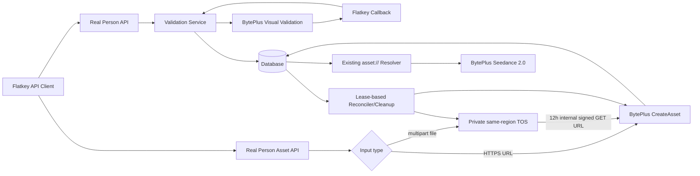

# BytePlus 真人素材库架构设计

> 状态：对话设计已批准，书面规格待用户审阅
> 设计日期：2026-07-30
> 适用范围：Flatkey / New API 的 Seedance 2.0 私有真人素材认证、素材管理与本地文件接入
> 前置能力：[BytePlus 素材库功能架构设计](./2026-07-29-byteplus-asset-library-design.md)

## 1. 文档目的

本文定义 Flatkey 真人素材库首期的产品边界、公开 API、数据模型、上游协议、安全与隐私、生产多节点并发、临时文件生命周期、错误语义、测试和发布要求。

目标调用方只需要 Flatkey API Key，即可为当前 Flatkey 用户认证多位真人，并为每位真人分别维护图片、视频和音频素材。调用方可以提交公网 HTTPS URL，也可以直接上传本地文件；本地文件不需要调用方自行托管或生成 URL。

本设计扩展现有 BytePlus 虚拟素材库，不改变现有 `POST /v1/assets`、`GET /v1/assets/{asset_id}`、`asset://ast_...` 引用改写和渠道固定语义。

## 2. 已确认的关键决策

| 主题 | 决策 |
| --- | --- |
| 用户归属 | 每个真人档案严格归属创建它的 Flatkey 用户；请求体不接受 `user_id` |
| 真人数量 | 一个 Flatkey 用户可以认证多位真人 |
| 上游分组 | 一位真人对应一个独立 BytePlus `GroupId` |
| 产品表面 | 首期只开放 API，不建设控制台 UI |
| 认证完成 | Flatkey 接收回调，同时允许客户端轮询；回调不作为可信结果本身 |
| 素材输入 | 同时支持公网 HTTPS URL 和本地 multipart 文件 |
| 本地文件桥 | Flatkey 流式写入与 ModelArk 同区域的私有 TOS，再生成短时内部 GET 签名 URL |
| 素材引用 | 继续使用 Flatkey `asset://ast_...`，不暴露上游 AssetId |
| 渠道 | 真人档案创建时绑定一个 BytePlus 渠道，后续认证、素材和生成不得静默漂移 |
| 多节点正确性 | 数据库唯一约束、条件更新、租约和持久化 outbox 是正确性来源，不依赖进程锁 |

## 3. BytePlus 官方约束

### 3.1 真人认证与建组

真人素材库不能复用虚拟素材库的 `CreateAssetGroup` 建组流程。真人档案必须按以下顺序创建：

1. Flatkey 调用 `CreateVisualValidateSession`，提交由 Flatkey 控制的 `CallbackURL` 和渠道配置中的 `ProjectName`。
2. BytePlus 返回一次性 `H5Link` 和有效期 30 分钟的 `BytedToken`。
3. 真人在 H5 页面完成授权和验证。
4. BytePlus 回调 Flatkey；Flatkey再调用 `GetVisualValidateResult`。
5. `GetVisualValidateResult` 返回的 `GroupId` 成为该真人档案唯一的上游素材组。

一个上游真人组只能对应一位真人。上传到组内的素材会进行人脸一致性检查，多人脸或不同真人素材可能失败。

### 3.2 素材创建

`CreateAsset` 只接受 URL，不接受本地文件体或 Base64。图片、视频和音频均为异步处理，只有 `Active` 素材才能参与 Seedance 生成。

| 类型 | 支持格式 | 官方限制 |
| --- | --- | --- |
| 图片 | JPEG、PNG、WebP、BMP、TIFF、GIF、HEIC、HEIF | `< 30 MB`；尺寸 300–6000 px；宽高比 `(0.4, 2.5)` |
| 视频 | MP4、MOV | `≤ 50 MB`；2–15 秒；24–60 fps；480p、720p 或 1080p |
| 音频 | WAV、MP3 | `≤ 15 MB`；2–15 秒 |

Flatkey 同步校验请求结构、真实 MIME 和文件大小；分辨率、时长、帧率、人脸一致性和内容审核以 BytePlus 异步结果为准。

### 3.3 能力前置条件

真人素材库是 invited-only 能力，目标 BytePlus 账号还必须具备 Advanced Creation Rights。真人素材库与虚拟素材库共享上游容量配额。

只有显式启用真人素材能力、凭据完整并配置同区域 TOS 的 BytePlus 渠道才能参与真人档案创建。没有可用渠道时返回稳定的能力不可用错误，不回退到普通 BytePlus 渠道。

## 4. 目标、范围与非目标

### 4.1 首期目标

1. 创建、重新发起、查询和列出用户自己的真人档案。
2. 支持一个用户拥有多个真人档案，每个档案独立认证并保存独立 `GroupId`。
3. 在真人档案下通过 URL 或本地文件创建图片、视频和音频素材。
4. 分页列出真人档案下的素材，并复用现有素材详情查询。
5. 删除用户自己的素材，并阻止删除中的素材继续参与新的视频任务。
6. 复用现有 Flatkey 素材 ID、状态同步、所有权验证、渠道固定和 Seedance URI 改写。
7. 对认证令牌、签名 URL、上游 ID、原始 URL和临时文件实施最小暴露和自动清理。
8. 在 SQLite、MySQL 和 PostgreSQL 上保持同一行为，并支持生产多节点并发。

### 4.2 明确不做

- 不建设真人素材控制台 UI。
- 不开放真人档案或上游素材组删除；BytePlus 对真人组删除有授权状态限制且操作不可逆。
- 不提供客户端预签名直传 TOS；首期文件最大 50 MB，使用 Flatkey 流式代理上传。
- 不自动转码、裁剪、抽帧或修复媒体。
- 不允许素材跨真人档案、跨 BytePlus 账号、跨项目或跨渠道迁移。
- 不增加素材创建或存储的独立用户账单项。
- 不允许调用方提交 BytePlus GroupId、AssetId、ProjectName、渠道 ID、AK/SK 或 TOS 签名 URL。
- 不放宽现有 Seedance 只允许同一 BytePlus 渠道素材的约束。

## 5. 总体架构



### 5.1 真人档案与现有素材组分离

现有 `BytePlusAssetGroup` 以 `(user_id, channel_id)` 唯一，表示虚拟素材库中某用户在某渠道的共享组。该模型不能表达“同一用户、同一渠道、多位真人”。

真人素材库新增独立 `BytePlusRealPersonProfile`，直接保存其绑定渠道和上游 `GroupId`。现有 `BytePlusAssetGroup` 的索引和语义保持不变。

`BytePlusAsset` 新增可空的 `real_person_profile_id`：

- 现有虚拟素材继续使用 `asset_group_id`，`real_person_profile_id` 为 `NULL`。
- 真人素材使用 `real_person_profile_id`；服务层从档案读取绑定渠道和 `GroupId`，不得调用现有随机素材渠道选择逻辑。
- 数据迁移只增加可空列和索引，不给历史行添加破坏性非空默认值。

### 5.2 渠道绑定

创建真人档案时，服务按用户分组、Token 固定渠道和 `seedance-2.0` 权限选择一个具备真人素材能力的 BytePlus 渠道。选择结果写入档案并成为不变量：

- 所有认证查询、素材创建、素材查询、素材删除和 Seedance 生成都使用该渠道。
- 档案绑定渠道禁用、凭据不完整或能力关闭时返回 `real_person_channel_unavailable`。
- 不因超时、限流或渠道故障自动切换到另一 BytePlus 账号。

### 5.3 单次视频请求的真人边界

首期一个 Seedance 请求中最多只能出现一个非空 `real_person_profile_id`。两个不同真人档案的素材即使属于同一用户、同一渠道，也返回 `asset_profile_conflict`，不得提交上游。

一个真人档案的素材可以与现有虚拟素材混用，但仍须满足同一渠道、类型匹配、`Active` 状态和 Token 权限约束。未来只有在 BytePlus 官方明确支持并完成安全验证后，才可放宽多真人混用限制。

## 6. 公开 API

所有公开接口使用现有 Flatkey Token 鉴权、全局 API 限流和模型请求限流。当前用户从 Token 上下文读取，任何路径参数查询都同时带 `user_id`；不存在和跨用户访问统一为 404。

三个创建操作——创建真人档案、重新发起认证、创建真人素材——都要求调用方提供非空 `Idempotency-Key`。现有虚拟素材 `POST /v1/assets` 的兼容契约不因此改变。

状态序列化遵循两套明确且互不混用的契约：

| 资源 | 内部状态 | API 状态 |
| --- | --- | --- |
| 真人档案 | `PendingVerification` / `Verifying` / `Active` / `Failed` / `Expired` | `pending_verification` / `verifying` / `active` / `failed` / `expired` |
| BytePlus 素材 | `Creating` / `Processing` / `Active` / `Failed` / `Deleting` / `Deleted` | 保持现有 PascalCase 原值，不转换大小写 |

所有返回 BytePlus 素材对象的创建、详情和列表接口都使用同一 PascalCase 契约。`Deleting` 和 `Deleted` 是现有 `BytePlusAsset.status` 的扩展，不另建 `is_deleted` 或旁路状态字段；`Deleted` tombstone 默认不作为普通素材对象返回。

### 6.1 接口清单

| 方法与路径 | 用途 |
| --- | --- |
| `POST /v1/real-persons` | 创建真人档案并启动首个认证会话 |
| `POST /v1/real-persons/{person_id}/verification-sessions` | 为失败或过期档案重新生成认证会话 |
| `GET /v1/real-persons` | 分页列出当前用户的真人档案 |
| `GET /v1/real-persons/{person_id}` | 查询档案并触发有界的认证结果同步 |
| `POST /v1/real-persons/{person_id}/assets` | 通过 JSON URL 或 multipart 文件创建素材 |
| `GET /v1/real-persons/{person_id}/assets` | 分页列出该真人的本地素材记录 |
| `GET /v1/assets/{asset_id}` | 复用现有接口查询并同步单个素材状态 |
| `DELETE /v1/assets/{asset_id}` | 对用户自己的 BytePlus 素材执行幂等删除 |

### 6.2 创建真人档案

```http
POST /v1/real-persons
Authorization: Bearer <flatkey-api-key>
Content-Type: application/json
Idempotency-Key: <caller-generated-key>
```

```json
{
  "name": "品牌代言人 A"
}
```

`name` 是当前用户自己的展示标签，长度 1–64，不是法定姓名，不发送给 BytePlus。成功返回 200：

```json
{
  "id": "rph_<32-character-id>",
  "object": "real_person",
  "name": "品牌代言人 A",
  "status": "pending_verification",
  "verification_url": "https://<byteplus-h5-link>",
  "verification_expires_at": 1785409200,
  "created_at": 1785407400
}
```

`verification_url` 只在创建或重新发起认证的响应中返回，不出现在列表和普通查询中。H5 链接密文最多保留到会话终态或过期，以支持创建请求的安全幂等重放；随后清空。

创建档案和重新认证接口使用同一重放规则：同一 `Idempotency-Key` 在 H5 链接仍有效时重放原始创建响应。会话进入终态或过期、H5 密文已经清空后，同 key 仍只指向原档案和原认证会话，不得创建新上游会话；响应返回档案的当前安全表示并省略 `verification_url`。调用方只有在档案仍允许重新认证时，才可使用新的幂等键调用重新认证接口获得新链接。

### 6.3 重新发起认证

```http
POST /v1/real-persons/rph_.../verification-sessions
Authorization: Bearer <flatkey-api-key>
Idempotency-Key: <caller-generated-key>
```

只有 `pending_verification`、`failed` 或 `expired` 档案可以创建新会话。创建成功后，新会话成为 `current_validation_session_id`；旧会话的迟到回调和查询结果不能更新档案。`active` 档案不能在首期主动重认证。

成功响应沿用 6.2 的真人档案对象结构，返回同一 `id`、新会话的 `verification_url` 和 `verification_expires_at`；认证会话 ID 不对外暴露。幂等重放及链接清理后的返回语义同 6.2。

### 6.4 查询与列出真人档案

```http
GET /v1/real-persons/{person_id}
GET /v1/real-persons?limit=20&after=rph_...
```

档案状态为：

- `pending_verification`：H5 尚未产生可确认结果。
- `verifying`：已收到回调或正在查询结果。
- `active`：已确认并持久化 `GroupId`，可以创建素材。
- `failed`：上游明确返回失败。
- `expired`：当前会话超过 30 分钟且未成功。

列表默认 `limit=20`，最大 100，按 `(created_time, id)` 倒序。`after` 是上一页最后一个 Flatkey 档案 ID。列表和查询永不返回 `BytedToken`、H5 链接、GroupId、渠道 ID或上游原始错误。

### 6.5 通过 URL 创建素材

```http
POST /v1/real-persons/{person_id}/assets
Authorization: Bearer <flatkey-api-key>
Content-Type: application/json
Idempotency-Key: <caller-generated-key>
```

```json
{
  "url": "https://example.com/reference.mp4",
  "asset_type": "Video",
  "name": "正面转身"
}
```

URL 必须是绝对公网 HTTPS 地址，不得包含 userinfo，并须通过现有域名、IP、端口和重定向安全规则。Flatkey 不主动下载该 URL，也不持久化完整 URL；调用方须保证它至少 12 小时可被 BytePlus 访问。

真人素材固定使用 BytePlus `Moderation.Strategy=Default`，首期不允许调用方跳过审核。

### 6.6 通过本地文件创建素材

```http
POST /v1/real-persons/{person_id}/assets
Authorization: Bearer <flatkey-api-key>
Content-Type: multipart/form-data
Idempotency-Key: <caller-generated-key>
```

表单字段：

| 字段 | 必填 | 说明 |
| --- | --- | --- |
| `file` | 是 | 本地图片、视频或音频文件 |
| `asset_type` | 是 | `Image`、`Video` 或 `Audio` |
| `name` | 否 | 1–128 字符；缺省时使用脱敏后的文件名 |

文件使用请求体硬上限和 `io.LimitReader` 双重限制。服务读取文件头判断真实 MIME，声明类型与真实类型不一致时返回 415。数据流式写入 TOS 并同时计算 SHA-256，不落 Flatkey 本机磁盘。

URL 和本地文件创建成功均返回 200：

```json
{
  "id": "ast_<32-character-id>",
  "object": "asset",
  "asset_type": "Video",
  "status": "Processing",
  "asset_uri": "asset://ast_<32-character-id>",
  "created_at": 1785407400
}
```

`asset_uri` 在 `status=Active` 前不能用于 Seedance。

### 6.7 素材列表和状态查询

```http
GET /v1/real-persons/{person_id}/assets?limit=20&after=ast_...
GET /v1/assets/{asset_id}
```

素材列表只读本地所有权记录，默认不包含 `Deleted`，并返回 `Creating`、`Processing`、`Active`、`Failed` 或 `Deleting` 状态。后台协调器会为带临时 TOS 对象的素材同步状态；单个详情查询继续复用现有上游同步路径。

为保持现有 `/v1/assets/{asset_id}` 契约不破坏：

- `Active` 和仍可查询的 `Processing` 返回 200 素材对象。
- `Deleting` 返回 200 tombstone 进行中的素材对象，但不再触发普通上游状态轮询；进入 `Deleted` 后按 404 处理。
- 本地尚未拿到上游 ID 时返回 409 `asset_not_ready`。
- `Failed` 返回 422 `asset_failed`。
- 列表接口本身始终返回 200，并可在列表项中展示 `Failed` 和脱敏失败码。

### 6.8 删除素材

```http
DELETE /v1/assets/{asset_id}
Authorization: Bearer <flatkey-api-key>
```

删除采用本地 tombstone 优先语义：

1. 以条件更新把用户拥有且未删除的素材改为 `Deleting`，使新的 `asset://` 解析立即拒绝该素材。
2. 有上游 AssetId 时调用 `DeleteAsset`；上游 404 视为已删除。
3. 没有上游 AssetId 时直接转为 `Deleted`。
4. 上游删除失败时保留 `Deleting` 和重试元数据，由后台协调器继续处理。
5. `Deleted` 为终态，记录保留用于幂等和审计，列表默认隐藏，详情按 404 处理。

首次删除和重复删除均返回 204。204 表示 Flatkey 已接受删除并完成本地不可再引用的 tombstone，不保证上游物理删除已在响应前完成。

## 7. 认证回调与可信边界

BytePlus 回调进入独立的非用户 API 路由。CallbackURL 包含高熵、单次会话关联令牌；数据库只保存其摘要，访问日志只记录路由模板，不记录令牌值。

回调处理规则：

1. 按令牌摘要查找未过期会话，并实施专用回调限流。
2. 回调的 `resultCode` 只作为诊断字段，不直接改变档案；任何结构合法且命中当前会话的回调都触发服务端结果查询。
3. 使用该会话的加密 `BytedToken` 调用 `GetVisualValidateResult`。
4. 只有服务端查询明确返回 `GroupId`，且会话仍是档案的当前会话，才能激活档案。
5. 重复回调幂等；旧会话、过期会话和终态会话不覆盖当前状态。
6. 回调丢失时，`GET /v1/real-persons/{id}` 使用同一查询逻辑，因此客户端轮询仍可完成认证。

`BytedToken` 和 H5 链接使用应用层可逆加密保存。加密密钥来自运行时秘密配置，不写数据库、不写日志；缺少密钥时真人素材能力整体不可用。会话进入成功、失败或过期终态后清空 H5 链接密文；`BytedToken` 只保留到完成必要的结果确认和短期审计后清空。

## 8. 数据模型

所有新模型同时加入普通迁移和快速迁移入口，并保持 SQLite、MySQL 5.7.8+、PostgreSQL 9.6+ 兼容。可选唯一字段使用真正的 `NULL`，不用空字符串占位。

### 8.1 `BytePlusRealPersonProfile`

| 字段 | 说明 |
| --- | --- |
| `id` | 本地主键 |
| `public_id` | `rph_` + 32 位密码学随机字符，唯一 |
| `user_id` | Flatkey 所有者，索引 |
| `name` | 用户展示标签 |
| `channel_id` | 创建时绑定的 BytePlus 渠道，索引 |
| `upstream_group_id` | 可空上游 GroupId，不对外返回 |
| `current_validation_session_id` | 可空当前认证会话 ID |
| `status` | `PendingVerification` / `Verifying` / `Active` / `Failed` / `Expired` |
| `error_code` | 脱敏内部稳定码 |
| `created_time` / `updated_time` | Unix 时间 |

`(channel_id, upstream_group_id)` 具备非空唯一语义。三种数据库均允许唯一索引中存在多个 `NULL`，但不允许使用空字符串代替未分配 GroupId。

### 8.2 `BytePlusVisualValidationSession`

| 字段 | 说明 |
| --- | --- |
| `id` / `public_id` | 本地主键和内部随机会话 ID |
| `profile_id` | 所属真人档案 |
| `callback_token_hash` | 回调令牌摘要，唯一 |
| `byted_token_ciphertext` | 加密 BytedToken |
| `h5_link_ciphertext` | 临时加密 H5Link，仅用于幂等重放 |
| `status` | `Creating` / `Pending` / `Checking` / `Succeeded` / `Failed` / `Expired` |
| `expires_at` | 上游令牌过期时间 |
| `upstream_request_id` | 脱敏运维关联字段 |
| `lease_updated_time` | 多节点查询租约版本 |
| `created_time` / `updated_time` | Unix 时间 |

认证结果写入必须使用 CAS：

```text
UPDATE profile
SET status = Active, upstream_group_id = ...
WHERE id = ?
  AND current_validation_session_id = ?
  AND status IN (PendingVerification, Verifying)
```

受影响行数不是 1 时，结果视为迟到或已被其他节点处理，不得覆盖现值。

### 8.3 `BytePlusAsset` 扩展

新增字段均可空或有向后兼容默认值：

| 字段 | 说明 |
| --- | --- |
| `real_person_profile_id` | 可空真人档案 ID；历史虚拟素材为 `NULL` |
| `name` | 素材展示名称 |
| `status` 扩展 | 在现有状态上增加 `Deleting` / `Deleted`；删除使用独立 CAS，不受普通状态轮询覆盖 |
| `delete_attempts` / `next_delete_at` | 上游删除重试状态 |
| `delete_lease_updated_time` | 多节点删除租约 |
| `deleted_time` | 本地 tombstone 时间 |

创建真人素材时，服务必须同时校验 `asset.user_id == profile.user_id` 和 `asset.channel_id == profile.channel_id`。视频引用解析收集所有非空 `real_person_profile_id`，集合大小大于 1 时拒绝请求。

### 8.4 `BytePlusAssetTempObject`

本地文件上传的临时对象使用独立持久化 outbox：

| 字段 | 说明 |
| --- | --- |
| `asset_id` | 对应本地素材，唯一 |
| `bucket` / `object_key` | 私有 TOS 定位信息，不对外返回 |
| `content_sha256` / `size_bytes` / `mime_type` | 完整性和审计元数据 |
| `signed_url_expires_at` | 签名 URL 到期时间；不保存 URL 本身 |
| `cleanup_status` | `Pending` / `Cleaning` / `Cleaned` |
| `cleanup_attempts` / `next_cleanup_at` | 重试状态 |
| `cleanup_lease_updated_time` | 多节点清理租约 |
| `cleaned_time` | 完成时间 |

### 8.5 `APIIdempotencyRecord`

创建类接口使用独立幂等账本，不依赖内存缓存：

| 字段 | 说明 |
| --- | --- |
| `user_id` / `route` / `key_hash` | 联合唯一；`route` 是稳定操作标识，原始幂等键不落库 |
| `request_hash` | 路径资源 ID 与规范化 JSON，或路径资源 ID、元数据与流式文件 SHA-256 的组合摘要 |
| `status` | `Receiving` / `Processing` / `CallingUpstream` / `Completed` / `Failed` / `OutcomeUnknown` |
| `resource_type` / `resource_public_id` | 指向已创建档案、会话或素材 |
| `response_status` / `response_payload` | 仅保存可安全重放的脱敏响应 |
| `upstream_call_started_at` | 上游调用开始前持久化，用于阻止不安全重试 |
| `lease_updated_time` | 多节点创建租约 |
| `expires_at` | 默认保留 24 小时 |

相同用户、路由和 key：

- 相同 request hash 返回同一资源；存在可安全重放的脱敏响应时重放该响应。认证 H5 链接清理后的重放遵循 6.2 的安全降级语义，不能为了保持原响应而延长敏感链接的保存期。
- 不同 request hash 返回 409 `idempotency_conflict`。
- multipart 在上传过程中计算内容摘要；并发或重试产生的新临时对象若最终发现冲突，必须立即进入清理 outbox，不能调用 `CreateAsset`。
- 同一 key 处于有效创建租约时，其他节点不得重复调用上游。
- 一旦状态进入 `CallingUpstream`，租约过期也不得使用同一 key 再次调用上游；无法确认结果时进入 `OutcomeUnknown`，后续重放返回同一稳定错误。
- `Failed` 只表示结果已经确定且存在可安全重放的 `response_status` 和脱敏 `response_payload`；同 key 重放该失败响应。进入 `CallingUpstream` 后若没有可安全确认和保存的响应，记录必须进入 `OutcomeUnknown`，返回稳定的 `idempotency_outcome_unknown`，不得降为可重试的 `Failed`，也不得再次调用上游。

`response_payload` 永不保存 `verification_url`、BytedToken 或其他敏感上游值。有效期内的认证重放只从对应 session 的 `h5_link_ciphertext` 临时解密并注入链接；密文清理后不存在账本副本可恢复该链接。

## 9. 本地文件与 TOS 生命周期

### 9.1 上传路径

1. 鉴权并验证真人档案属于当前用户且内部状态为 `Active`。
2. 创建或认领幂等记录和本地素材占位记录。
3. 对请求体实施硬字节上限，读取文件头校验 MIME。
4. 使用不可猜对象键流式写入私有 TOS，同时计算 SHA-256；对象键不包含原始文件名。
5. 持久化 `BytePlusAssetTempObject`，再生成有效期 12 小时的 internal GET 签名 URL。
6. 使用档案的 GroupId、渠道凭据和签名 URL 调用 `CreateAsset`。
7. 持久化上游 AssetId 和 `Processing` 状态；响应只返回 Flatkey 字段。

### 9.2 清理路径

- 上传、签名或 `CreateAsset` 同步失败时立即尝试删除对象；失败写入 outbox 重试。
- 素材进入 `Active` 或 `Failed` 后立即清理临时对象。
- 客户端不轮询也必须清理：所有节点可运行协调器，但只有通过数据库条件更新取得租约的节点执行状态查询或删除。
- 对签名 URL 已过期但素材仍未终态的记录，协调器最后查询一次上游后清理源对象；不伪造上游素材终态。
- TOS Bucket 配置 24 小时对象生命周期，作为应用清理失败的最后兜底，不替代 outbox。
- 删除失败按退避时间重试；`Cleaned` 是终态，迟到任务不能改回 `Pending`。

签名 URL 不返回客户端、不持久化、不写日志。TOS bucket、object key 和 internal endpoint 也不进入普通 API 响应。

## 10. 多节点并发和恢复

### 10.1 创建认证会话

幂等账本先于上游调用写入。取得有效创建租约的节点才能调用 `CreateVisualValidateSession`。上游成功后必须先加密并持久化 BytedToken/H5Link，再把响应返回客户端。

节点在调用上游前先把账本改为 `CallingUpstream`。若节点在上游成功后、本地持久化前崩溃，可能留下一个最多 30 分钟的孤立上游会话；Flatkey 不声称该请求成功，也不使用同一幂等键自动重试。租约恢复节点把记录改为 `OutcomeUnknown`，调用方必须使用新的幂等键重新发起。该风险无法在上游未提供幂等键或按客户端键查询时完全消除。

### 10.2 认证结果

回调和客户端轮询可能并发。节点先对 session 获取短租约，再查询上游，最后使用 `current_validation_session_id` 和档案当前状态做 CAS。只有当前会话可以激活档案。

### 10.3 创建素材

幂等账本保证同一用户、路由和 key 至多开始一次 `CreateAsset`。节点在调用前持久化 `CallingUpstream`；如果节点在上游成功后、本地 AssetId 持久化前崩溃，可能留下孤立上游素材。恢复节点把幂等记录标记为 `OutcomeUnknown`，把本地素材标记为 `Failed` 并写入脱敏错误码 `idempotency_outcome_unknown`，同时告警；不能猜测上游 ID，也不能使用同一 key 再次调用上游。

### 10.4 删除和清理

素材 tombstone、上游删除和 TOS 清理分别使用条件状态和带版本的租约。实现不使用数据库专属的 `SKIP LOCKED`、部分唯一索引或进程互斥量；以 `UPDATE ... WHERE status/lease ...` 的受影响行数判定所有权，兼容三种数据库。

## 11. 安全与隐私

### 11.1 所有权

- 所有档案和素材查询均带当前 `user_id`。
- 跨用户 ID 与不存在 ID 使用同一 404 语义。
- `user_id`、渠道 ID、GroupId 和 AssetId 不接受客户端输入。
- `asset://` 解析再次验证用户、类型、状态、真人档案集合和渠道，不依赖创建接口已校验的假设。

### 11.2 URL 与文件

- 外部 URL 只允许 HTTPS，拒绝 userinfo、localhost、私网/保留地址和不允许端口。
- 完整外部 URL 不落库；日志只允许记录去除 query/fragment 的安全关联信息。
- 本地文件不落应用磁盘；原始文件名只用于生成脱敏展示名，不进入对象键。
- TOS bucket 私有且与 ModelArk 同区域；运行身份只具备目标前缀的上传、签名和删除最小权限。
- 不接受 Base64 素材。

### 11.3 禁止暴露的数据

- Flatkey Token、BytePlus API Key、AK/SK、Authorization 和签名头。
- BytedToken、H5 链接密文、回调令牌、TOS 签名 URL。
- 上游 GroupId、AssetId、ProjectName、渠道 ID、Bucket 和对象键。
- 上游原始错误正文、完整源 URL和完整结构化 Channel.Key。

## 12. 错误模型

错误沿用 OpenAI 兼容 envelope，并使用稳定、可国际化的公开消息。

| 场景 | HTTP | 稳定错误码 |
| --- | ---: | --- |
| 请求字段、档案名称、URL 或类型非法 | 400 | `invalid_real_person_request` / `invalid_asset_request` |
| Token 无效 | 401 | 现有鉴权错误 |
| Token 无 `seedance-2.0` 权限 | 403 | `access_denied` |
| 档案或素材不存在、已删除或跨用户 | 404 | `real_person_not_found` / `asset_not_found` |
| 档案尚未 Active | 409 | `real_person_not_active` |
| 认证会话仍由另一节点创建或查询 | 409 | `verification_in_progress` |
| 同一幂等键对应不同请求 | 409 | `idempotency_conflict` |
| 同一视频请求混用不同真人档案 | 409 | `asset_profile_conflict` |
| 文件超过类型上限 | 413 | `asset_file_too_large` |
| MIME、格式或声明类型不匹配 | 415 | `asset_media_unsupported` |
| 素材异步处理失败 | 422 | `asset_failed` |
| 上传 TOS 失败 | 502 | `asset_upload_failed` |
| BytePlus 超时、非成功响应或协议异常 | 502 | `verification_upstream_error` / `asset_upstream_error` |
| 上游调用开始后节点崩溃，结果无法确认 | 502 | `idempotency_outcome_unknown` |
| 无真人能力渠道或绑定渠道不可用 | 503 | `real_person_channel_unavailable` |
| 数据库读写或加密配置失败 | 500 | `real_person_storage_error` / `asset_storage_error` |
| 用户或系统限流 | 429 | 现有限流错误 |

人脸不一致、多人脸和内容审核失败只映射为稳定失败码，不回传上游原始文本。

## 13. 渠道和运行时配置

现有结构化 BytePlus Channel.Key 继续保存 `api_key`、`access_key_id`、`secret_access_key` 和 `project_name`。真人素材能力增加非默认启用的配置段：

```json
{
  "real_person_assets": {
    "enabled": true,
    "tos_bucket": "<private-bucket>",
    "tos_region": "ap-southeast-1",
    "tos_internal_endpoint": "<validated-internal-endpoint>"
  }
}
```

约束：

- `enabled` 缺省为 false。
- TOS region 必须与当前 ModelArk 素材服务 region 一致。
- Bucket 和 endpoint 经过严格配置校验，不接受请求级覆盖。
- AK/SK 必须同时具备 ModelArk 真人素材 API 和目标 TOS 前缀的最小权限。
- 回调基地址来自受信任运行时配置，不从请求 Host 推导，避免 Host Header 污染。

## 14. 可观测性

允许记录：

- Flatkey request ID、公开档案/素材 ID、内部渠道 ID。
- 脱敏 BytePlus RequestId、操作名、耗时、HTTP 状态和稳定错误码。
- 认证和素材状态迁移、CAS 失败、租约接管、幂等命中与冲突。
- TOS 上传字节数、清理状态、清理重试次数；不记录对象键和签名 URL。

建议指标：

- 认证创建、成功、失败、过期率和耗时分布。
- 素材按类型的创建、Active、Failed、删除率和处理耗时。
- `asset_profile_conflict`、跨用户 404、渠道不可用和上游错误率。
- 临时对象未在 1 小时内清理的数量、24 小时生命周期兜底删除数量。
- 幂等重放、冲突、租约接管和孤立上游资源告警。

## 15. 测试策略

### 15.1 自动化测试

| 层级 | 必须覆盖 |
| --- | --- |
| Model | 三库迁移、nullable 唯一字段、多真人同渠道、session CAS、租约接管、tombstone、outbox 终态 |
| Idempotency | 同 key 同 hash 重放、不同 hash 冲突、并发节点只调用一次上游、multipart 冲突对象清理 |
| Client | CreateVisualValidateSession、GetVisualValidateResult、ListAssets、DeleteAsset 的签名、字段和错误脱敏 |
| Callback | 合法、重复、伪造、过期、旧 session 乱序、新旧 session 并发、回调丢失后轮询恢复 |
| Upload | URL 安全、MIME 嗅探、三类大小限制、上传中断、TOS 签名、同步失败和清理重试 |
| Asset | 真人档案归属、绑定渠道、Active/Failed、列表分页、删除幂等、上游 404 删除成功 |
| Resolver | 跨用户、跨渠道、跨真人、虚拟+单真人、类型不匹配、Deleting/Deleted 拒绝 |
| HTTP | Token、模型权限、JSON/multipart 双输入、状态码、错误 envelope、敏感字段不出现 |
| Regression | 现有虚拟素材创建/查询、`asset://` 改写、渠道固定和普通 Seedance 请求不变 |

### 15.2 受控集成验证

在具备 invited-only 权限和 Advanced Creation Rights 的测试渠道中验证：

1. 同一 Flatkey 用户创建并认证两位真人。
2. 第二个 Flatkey 用户无法查询或引用第一个用户的档案和素材。
3. URL、本地图片、本地视频和本地音频分别创建并进入 `Active`。
4. 多人脸、不同真人、格式错误和超限文件进入预期错误路径。
5. 两个真人档案的素材不能出现在同一 Seedance 请求。
6. 单真人素材与同渠道虚拟素材可以共同生成。
7. 删除后素材立即不能用于新任务，重复 DELETE 返回 204，最终完成上游删除。
8. TOS 临时对象在素材终态后删除，模拟删除失败时 outbox 重试，24 小时生命周期兜底生效。
9. 日志和 API 响应不包含凭据、BytedToken、签名 URL、GroupId、AssetId 和对象键。

### 15.3 当前分支基线

建立本设计分支前，现有 BytePlus 定向测试已通过：

```text
go test ./service -run 'BytePlusAsset|BytePlusCredentials' -count=1
go test ./controller -run 'BytePlusAsset' -count=1
go test ./router -run 'BytePlusAsset' -count=1
go test ./middleware -run 'BytePlusAsset' -count=1
go test ./relay/channel/task/byteplus -run 'Asset' -count=1
```

全仓 `go test ./...` 的既有基线未通过：根包缺少未生成的 `web/classic/dist`，且部分 Windows SQLite 测试在 TempDir 清理时仍持有数据库文件句柄。该缺口与本功能无关，但实施完成后仍须运行本功能定向测试、构建和能够执行的全仓检查，并明确报告未解决的既有失败。

## 16. 发布、部署与回滚

### 16.1 发布前置条件

1. BytePlus 测试与目标生产账号已开通真人素材库和 Advanced Creation Rights。
2. 每个启用渠道已有同区域私有 TOS Bucket、最小权限和 24 小时生命周期规则。
3. staging 与 production 分别配置自己的 HTTPS 回调基地址，不能交叉使用。
4. 应用加密密钥已通过秘密管理配置到需要处理认证的节点。
5. 数据库账号具备新增表、列和索引权限。

### 16.2 数据库迁移

- 新增真人档案、认证会话、临时对象 outbox 和幂等账本表。
- 向 `BytePlusAsset` 仅增加可空/兼容字段和索引。
- 普通迁移和快速迁移入口必须同时注册。
- 不删除或修改现有 `(user_id, channel_id)` 虚拟素材组唯一索引。
- 上线前分别验证 SQLite、MySQL 和 PostgreSQL 的建表、重复迁移和 NULL 唯一语义。

### 16.3 部署目标

- Router deploy：required。新增 `/v1` 路由、认证回调、上传、引用限制和素材删除都影响 API 流量。
- Console/legacy Go service：按当前共享二进制和迁移职责部署同版本，确保数据库模型一致。
- Website deploy：not required。首期没有官网或控制台页面。
- Staging：先合入远程 `staging` 触发部署并完成受控真人认证验证。
- TOS：需要独立准备 Bucket、权限和生命周期；不属于现有 GCP Terraform 自动创建范围。

### 16.4 回滚

1. 关闭所有渠道的 `real_person_assets.enabled`，阻止新档案和新真人素材创建。
2. 保留回调、查询、删除和 outbox 清理能力，直至处理中的会话和临时对象收敛。
3. 回滚应用版本时保留新增表和列，避免丢失所有权、删除和清理状态。
4. 确认没有待清理对象后，才可停止旧版本协调器。
5. 不自动删除上游真人组；需要单独合规评估和人工操作。

## 17. 验收标准

1. 客户只凭 Flatkey API Key 和本地文件即可完成认证、素材创建、轮询至可用并使用 `asset://...` 生成视频。
2. 一个用户可以拥有多个独立真人档案；每个档案只绑定一个 GroupId 和一个 BytePlus 渠道。
3. 跨用户档案和素材不可查询、不可枚举、不可引用。
4. 回调丢失、重复和乱序不影响最终正确性，旧 session 不能覆盖新 session。
5. 同一视频请求不能混用两个真人档案的素材。
6. 同一幂等键在生产多节点下至多产生一个本地资源并至多开始一次上游创建调用；结果不明时禁止自动重试该 key。
7. 删除请求先阻止新引用，重复返回 204，并最终完成上游删除或持续可观测重试。
8. 本地文件不落应用磁盘；签名 URL 不返回、不落库、不写日志；临时对象最终由 outbox 或 24 小时生命周期删除。
9. 现有虚拟素材创建、查询、引用改写和渠道固定行为无回归。
10. 所有迁移和条件更新在 SQLite、MySQL、PostgreSQL 上通过自动化验证。

## 18. 官方参考

- [Private real-human asset library guide](https://docs.byteplus.com/en/docs/ModelArk/2333589)
- [Real-human portrait library guide](https://docs.byteplus.com/en/docs/ModelArk/2333602)
- [CreateVisualValidateSession](https://docs.byteplus.com/en/docs/ModelArk/2333587)
- [GetVisualValidateResult](https://docs.byteplus.com/en/docs/ModelArk/2333588)
- [CreateAsset](https://docs.byteplus.com/en/docs/ModelArk/2318271)
- [DeleteAsset](https://docs.byteplus.com/en/docs/ModelArk/2318278)
- [DeleteAssetGroup](https://docs.byteplus.com/en/docs/ModelArk/2341606)
- [Upload files by using an internal TOS presigned URL](https://docs.byteplus.com/en/docs/ModelArk/2551760)
- [Virtual portrait library guide](https://docs.byteplus.com/en/docs/ModelArk/2333565)
