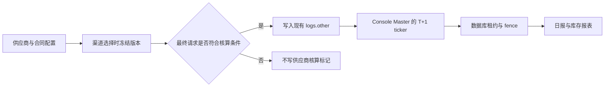

# 上游供应链与利润核算 V1

本文档定义供应商利润核算 V1 的最小交付范围。日常检查、故障处理和自动历史 catch-up 见[供应商日结运维手册](./supplier-accounting-operations.md)。

## 1. 目标

V1 管理“供应商—合同—采购折扣—渠道”的关系，并基于请求成功时冻结的事实回答：

- 业务用户产生的销售额、采购成本、毛利润和毛利率；
- 业务用户与排除的内部用户分别消耗了多少官方原价库存；
- 每份合同累计入库、累计消耗和剩余库存；
- 指定供应商、合同、渠道、模型和日期范围的管理报表。

金额统一使用整数 micro-USD（`1 USD = 1,000,000 micro-USD`）。采购折扣使用 PPM，例如 6.5 折记为 `650000`。



## 2. V1 范围边界

V1 只新增供应商配置、请求成功快照、T+1 日汇总、管理报表和自动历史 catch-up。

V1 不新增：

- Redis 队列、分布式队列或供应商专用缓存协议；
- Cloud Run Job、Cloud Scheduler 或独立批处理进程；
- GitHub Actions 工作流、构建清单、容量准入门槛或发布激活流程；
- Terraform、WIF、服务账号或 Secret Manager 资源；
- 控制面状态机、mutation gate、activation、coverage gap 或已完成日期 rerun；
- Prometheus 指标、告警规则或监控 sidecar 配置。

供应商核算随现有 Go 应用部署。Router 负责在成功结算日志中保存快照；Console/Master 负责日结、管理接口和报表。

## 3. 请求级核算

### 3.1 生成快照的唯一条件

只有同时满足以下条件的请求才在现有 `logs.other` 中写入 `supplier_accounting_v1`：

1. 最终请求成功并完成现有客户计费结算；
2. 最终成功尝试使用的渠道在请求选择时已绑定有效供应商合同；
3. 请求路径已支持供应商官方价核算；
4. 最终用量或最终销售额度为正，能够证明发生了实际消费；
5. 消费日志成功持久化。

以下情况不写任何供应商核算标记或占位对象：

- 请求失败、退款或未完成最终结算；
- 最终用量与最终销售额度均为零；
- 最终成功渠道没有供应商合同绑定；
- 当前不支持的同步或异步计费路径；
- 无法安全计算官方原价、采购成本或销售额。

因此，V1 日报的事实全集是“带有效 `supplier_accounting_v1` 快照的成功消费日志”。没有标记表示不属于 V1 可核算事实，不能被日结任务推断为零金额、失败类别或缺失金额。

### 3.2 冻结时机

渠道选定时，从供应商运行时配置中按值复制：

- 供应商 ID；
- 合同 ID；
- 渠道绑定版本 ID；
- 采购折扣版本 ID；
- 采购折扣 PPM；
- 用户是否命中显式统计排除规则及规则 ID。

如果请求发生渠道重试，以最终成功渠道对应的冻结配置为准。后续修改合同、折扣、绑定或排除规则，不改变已经写入日志的历史事实。

### 3.3 金额口径

```text
procurement_cost_micro_usd =
  ROUND_HALF_UP(official_list_micro_usd × procurement_multiplier_ppm / 1,000,000)

sales_micro_usd =
  按现有结算链路的最终销售 Quota 和请求时 quota_per_unit 换算

gross_profit_micro_usd = sales_micro_usd - procurement_cost_micro_usd

gross_margin = gross_profit_micro_usd / sales_micro_usd
```

- `official_list_micro_usd` 复用请求发生时的官方模型定价输入和实际用量证据，不乘用户分组倍率；
- ratio、固定价、阶梯表达式、音频、图片和工具调用均沿用现有计费模式，不能统一简化为“单价 × token”；
- 计算过程使用十进制定点语义，最终只舍入一次；
- 中间结果溢出、字段不完整或公式校验失败时，不写快照；
- 毛利率只在销售额为正且销售额、采购成本均已知时计算。

### 3.4 业务用户与内部用户

统计排除规则按显式 `user_id` 配置，不按 root、admin 等角色动态推断。

| 范围 | `logs.other` 快照 | 日报用途 |
| --- | --- | --- |
| 业务用户 | 完整保存供应商/合同/版本、官方原价、采购成本、销售额、毛利润和报表维度 | 销售、成本、利润、毛利率和库存 |
| 排除的内部用户 | 紧凑保存供应商/合同/版本、排除规则、官方原价库存消耗及对应采购成本 | 只进入内部库存与成本，不进入销售额、毛利润或业务高维明细 |

内部快照不保存销售额、销售倍率或毛利润。日报也不得通过其他日志字段反推这些值。

## 4. 数据模型

V1 新增恰好八张表：

| 表 | 职责 |
| --- | --- |
| `upstream_suppliers` | 供应商主体及状态 |
| `supplier_contracts` | 供应商合同、展示信息和容量备注 |
| `supplier_contract_rate_versions` | 追加式采购折扣版本；历史版本不可改写 |
| `supplier_channel_binding_versions` | 追加式渠道—合同绑定与解绑历史 |
| `supplier_inventory_adjustments` | 追加式库存入库、冲正和人工调整台账 |
| `supplier_statistics_exclusion_rules` | 显式用户统计排除/恢复版本 |
| `supplier_usage_daily_summaries` | 按日期与业务维度聚合的日报事实 |
| `supplier_usage_daily_batch_runs` | 每个核算日的状态、游标、数据库租约、fence 和发布版本 |

现有 `logs` 表不新增供应商专用物理列或索引。不可变请求事实写入已有 `other` 字段；日结从 `LOG_DB` 读取消费日志并向主库写入两张日结表。未配置独立日志库时，`LOG_DB` 与主库相同。

供应商、合同、折扣、绑定、库存调整和排除规则均保存在主库。所有数据库访问必须同时兼容 SQLite、MySQL 5.7.8+ 和 PostgreSQL 9.6+。

## 5. T+1 日结

### 5.1 调度

日结复用现有 Master 定时任务模式：Console/Master 进程在启动后创建进程内 ticker，Router/Slave 不启动任务。时区固定为 `Asia/Shanghai`，每日 02:00 关账缓冲结束后，ticker 尝试处理最早一个尚未完成的 D-1 或更早自然日。

每次调用最多推进一个自然日。仍有积压时由后续 ticker 继续推进，避免一次运行无界扫描历史日志。

### 5.2 扫描与发布

- 只扫描目标北京时间自然日内的成功消费日志；
- 使用 `(created_at, id)` keyset 分页，每页有固定上限；
- 只解析存在且有效的 `supplier_accounting_v1` 快照；
- 业务快照按供应商、合同、渠道、模型、版本和定价维度汇总；
- 内部快照只按库存核算所需的低维字段汇总；
- 候选 generation 完整结束后才发布；报表只读取已发布 fence；
- 扫描或写入失败时保留上一已发布 generation，不展示部分结果。

日报归属日取消费日志 `created_at` 所在的 `Asia/Shanghai` 自然日，不使用请求开始时间或财务确认时间替代。

### 5.3 多节点安全

所有 Console/Master 实例都可能启动 ticker，因此进程内 `sync.Once` 或运行标记只负责单进程去重，不能承担全局正确性。全局串行化依赖主库：

- 每个核算日只有一条 batch run；
- 使用数据库时间判断租约有效期；
- 获取或接管租约时递增 fence token；
- 每页写入与游标推进在事务中校验 owner、fence 和旧游标；
- 只有当前 fence 可以发布；过期 owner 不能覆盖新 owner；
- 唯一约束和幂等聚合保证重复 ticker、进程重启和响应丢失不会重复记账。

V1 不依赖 Redis 锁或单实例部署假设。

## 6. 管理报表与自动历史 catch-up

管理端提供概览、趋势、合同、渠道和明细视图。日期范围有固定上限，列表接口分页，并支持按供应商、合同和渠道筛选。

报表必须保持以下口径：

- 业务用户展示完整销售额、采购成本、毛利润和毛利率；
- 内部用户只展示官方原价库存消耗及对应采购成本；
- 合同库存余额 = 库存调整累计值 − 业务与内部官方原价累计消耗；
- 只读取已发布的日报 generation；运行中或失败的候选数据不可见；
- 报表明确显示最新完成日期和批次状态，不能把缺失日期当作零消费。

历史 catch-up 只用于处理“快照功能上线后、尚未生成汇总”的历史日期：

- V1 不提供手动回填、日报重跑 HTTP 接口或前端入口；
- Console/Master ticker 自动选择最早未完成日期，每次只推进一天；
- 配置 `SUPPLIER_ACCOUNTING_CUTOVER_AT` 时从该时间所在的北京时间自然日开始逐日 catch-up；未配置时从 D-1 开始；
- 与日常 ticker 共用数据库租约、fence、分页和发布逻辑；
- 只消费日志中已经存在的快照，不回写日志、不推断无标记日志；
- 已完成日期不提供任意 rerun；修正基础事实应通过追加库存调整或后续明确版本处理。

## 7. 验收标准

V1 完成必须至少证明：

1. 迁移只新增上述八张表，且 SQLite、MySQL、PostgreSQL 均可启动和读写；
2. 业务成功请求写完整快照，内部排除请求写紧凑库存快照；
3. 失败、零用量、未绑定和不支持路径均不写供应商标记；
4. 折扣、绑定和排除规则在请求期间变更时，历史日志仍使用冻结版本；
5. T+1 ticker 只在 Master/Console 启动，并在多节点竞争、租约过期和旧 owner 恢复时保持 fence 安全；
6. 日结同时支持共享库与独立 `LOG_DB`，分页不会漏读或重复读取；
7. 管理报表只读取已发布数据，业务与内部口径严格隔离；
8. 自动历史 catch-up 每次只推进一天，且不会重建无标记历史事实。
