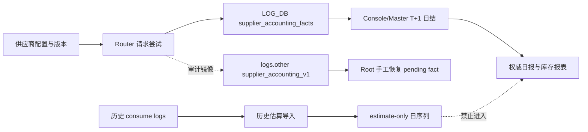

# 上游供应链与利润核算 V1

本文档是供应商供应链、权威利润核算和历史估算的设计基线。发布、日常核对、故障恢复、留存和历史导入操作见[供应商核算运维手册](./supplier-accounting-operations.md)。

## 1. 目标与金额口径

V1 管理“供应商—合同—采购折扣版本—渠道绑定版本”，并回答：

- 业务用户的销售额、采购成本、毛利润和毛利率；
- 被显式排除的内部用户消耗的官方原价库存及采购成本；
- 合同累计入库、官方原价消耗、剩余库存及是否超卖；
- 按自然日、供应商、合同、渠道和模型查询权威报表；
- 对上线前少量历史消费日志发起独立、明确标注的估算导入。

所有金额使用整数 micro-USD（`1 USD = 1,000,000 micro-USD`）。采购折扣使用 PPM，例如 6.5 折为 `650000`。

```text
procurement_cost_micro_usd =
  ROUND_HALF_UP(official_list_micro_usd × procurement_multiplier_ppm / 1,000,000)

gross_profit_micro_usd = sales_micro_usd - procurement_cost_micro_usd

gross_margin = gross_profit_micro_usd / sales_micro_usd
```

官方原价直接复用请求发生时的模型定价配置和最终用量，不乘用户分组倍率。ratio、固定价、阶梯表达式、音频、图片和工具调用沿用现有计费模式，使用十进制定点语义并在最终结果只舍入一次。

## 2. 三条相互隔离的数据链路


```mermaid
flowchart LR
    A[供应商配置与版本] --> B[Router 请求尝试]
    B --> C[LOG_DB supplier_accounting_facts]
    C --> D[Console/Master T+1 日结]
    D --> E[权威日报与库存报表]

    B -.审计镜像.-> F[logs.other supplier_accounting_v1]
    F --> G[Root 手工恢复 pending fact]

    H[历史 consume logs] --> I[历史估算导入]
    I --> J[estimate-only 日序列]
    J -.禁止进入.-> E
```

### 2.1 权威事实链路

权威日结的唯一请求级数据源是 `LOG_DB.supplier_accounting_facts`，不是通用 `logs` 表：

1. Router 在已绑定的同步上游尝试发出前创建 `pending` fact；
2. 最终成功、用量完整且金额校验通过时写为 `captured`；
3. 明确没有财务消费的尝试写为 `void`；
4. 响应不完整、生产者错误或终态不明确时保持 `pending`，阻止对应自然日关账；
5. Root 可审计后将 pending 置为 void，或从匹配的通用消费日志恢复 captured。

每个 fact 绑定唯一 attempt ID，并冻结供应商、合同、绑定版本、折扣版本、渠道、模型、覆盖口径和 captured payload hash。渠道重试以每次真实上游尝试为单位建 fact；日结只扫描 `captured`。

### 2.2 通用日志镜像

现有 `logs` 表不增加供应商专用列或索引。成功消费日志的 `other` 可保存 `supplier_accounting_v1` 及 attempt ID，作用是请求审计、日志详情展示和 pending fact 的人工恢复证据。

通用日志不是权威日结源；日志缺失不能让已 captured fact 消失，日志存在也不能绕过 fact 终态和日结发布门。Root 可查看完整财务对象，Admin 和普通用户的日志响应必须删除该对象。

### 2.3 历史估算链路

历史估算只用于上线前没有权威 fact 的少量消费日志：

- Root 在控制台“历史估算”独立页创建不可变命令；
- 命令冻结北京时间 `[start_date, end_date)`、quota-per-unit、排除用户 ID、渠道到供应商/合同/折扣版本的显式映射及原因；
- 后台 worker 首次取得 lease 时冻结 `LOG_DB` 最大日志 ID 和候选条数；后续接管与重试复用首次冻结值，并只按 `(created_at, id)` keyset 扫描该范围；
- 只统计最终成功的 consume 日志；销售额由 quota 和冻结 QPU 估算，官方原价还要求日志中存在有效 group ratio，采购成本还要求显式渠道映射；
- 完成前必须重新核对 `verified_count == processed_count == candidate_count`；运行中或失败的部分金额不发布；
- 结果永久标记 `estimate_only`，只写历史估算表，权威日报和库存永远不读取。

同一时间范围已有 pending、running 或 completed 导入时拒绝重复创建；failed 导入可修正命令后重建。调度器每分钟最多推进一页，不新增 Redis、队列或独立 goroutine。

## 3. 统计范围

统计排除按显式 `user_id` 版本规则判断，不按 root/admin 角色动态推断。

| 范围 | 权威 captured payload | 日报用途 |
| --- | --- | --- |
| 业务用户 | 供应商/合同/版本、官方原价、销售额、采购成本、毛利润及定价证据 | 销售、成本、利润、毛利率和库存 |
| 内部排除用户 | 供应商/合同/版本、排除规则、官方原价和采购成本 | 默认只进入内部成本和库存，不进入业务销售或利润；渠道可配置为在 fact 创建前完全跳过内部请求 |

无法安全计算、字段不完整、金额溢出或定价证据不一致时不得伪造 captured。此类已准备尝试保持 pending，交由审计解决。

渠道绑定版本同时冻结内部请求核算策略。`记录内部成本` 为默认值；选择 `完全跳过` 后，仅被排除账号通过该渠道发起的请求不创建 `supplier_accounting_facts`，普通账号请求仍正常记录。该策略随渠道运行时缓存发布，请求链路不增加数据库或 Redis 查询。

## 4. 数据模型：共 11 张供应商表

### 4.1 主库 10 张

| 表 | 职责 |
| --- | --- |
| `upstream_suppliers` | 供应商主体及状态 |
| `supplier_contracts` | 合同、容量信息和状态 |
| `supplier_contract_rate_versions` | 追加式采购折扣版本 |
| `supplier_channel_binding_versions` | 追加式渠道绑定/解绑版本 |
| `supplier_inventory_adjustments` | 追加式库存入库、冲正和调整台账 |
| `supplier_statistics_exclusion_rules` | 显式用户排除/恢复版本 |
| `supplier_usage_daily_summaries` | 按发布 fence 隔离的权威日汇总 |
| `supplier_usage_daily_batch_runs` | 自然日租约、游标、水位、fence 和发布状态 |
| `supplier_historical_imports` | 不可变历史估算命令、冻结水位、租约和进度 |
| `supplier_historical_daily_summaries` | estimate-only 历史日序列 |

### 4.2 LOG_DB 1 张

| 表 | 职责 |
| --- | --- |
| `supplier_accounting_facts` | 每个真实同步上游尝试的 durable pending/captured/void 权威生命周期 |

未配置独立 `LOG_SQL_DSN` 时 LOG_DB 与主库共享物理数据库，此时 11 张表位于同一数据库，但职责边界不变。所有迁移和查询同时支持 SQLite、MySQL 5.7.8+、PostgreSQL 9.6+。

## 5. T+1 日结与多节点安全

Console/Master 复用现有每分钟 ticker；Router/Slave 不执行日结。时区固定 `Asia/Shanghai`，02:00 关账缓冲后每次最多处理一个最早未完成自然日。

每个自然日的流程：

1. 主库获取 batch lease 并递增 fence；
2. LOG_DB 冻结该日 `source_max_fact_id` 和覆盖口径；
3. 若水位内仍有 pending fact，批次失败且不发布；
4. 按 fact ID keyset 分页扫描 captured payload；
5. 每页汇总写入与游标推进在同一主库事务内校验 owner、fence 和旧游标；
6. 结束时再次验证 fact 水位和 pending 状态；
7. 只有当前 fence 可发布，报表只读取 published fence。

多个 Console 实例、Cloud Run 重叠修订和实例重启都可能同时触发 ticker。进程内标记只减少本进程重入，正确性依赖数据库租约、唯一约束、CAS 游标和 fence；不依赖 Redis 或单实例顺序。

## 6. 报表和库存

权威报表提供概览、趋势、合同、渠道和明细视图，并遵守：

- 只读取 completed batch 的 published fence；
- pending、running、failed 批次不可暴露部分汇总；
- 缺失或未完成日期不能当作零消费；
- 业务与内部范围严格隔离；
- 合同余额 = 库存调整累计值 − 业务与内部官方原价累计消耗；
- 按渠道筛选导致内部维度不可完整归属时返回未知，不以业务小计冒充总计；
- 历史估算结果不参与任何权威利润或库存计算。

## 7. Cutover、catch-up 与留存

`SUPPLIER_ACCOUNTING_CUTOVER_AT` 是 Unix 秒，必须对应 `Asia/Shanghai 00:00:00`。未配置时 Router 不创建 fact，Console 也不从历史日期启动权威 catch-up。配置后：

- cutover 前的请求不创建 fact；
- cutover 起，已绑定同步 relay 尝试进入 durable fact 协议；
- Console 从 cutover 自然日开始逐日处理，不能从通用日志推断或补造权威事实；
- 任一天存在 pending fact 时必须先审计解决，不能强行发布。

`SUPPLIER_ACCOUNTING_FACT_RETENTION_DAYS` 未设置或为 `0` 时不删除事实。大于零时，Console 只对已完成且超过保留期的自然日，按已发布 `source_max_fact_id` 每次最多删除 5000 条 captured/void fact；pending 永不由留存任务删除。日汇总、批次水位和通用日志不受该任务影响。

## 8. V1 非目标

V1 不新增 Redis 队列、Cloud Run Job、Cloud Scheduler、供应商专用 runner、Terraform 资源、GitHub Actions 工作流、Prometheus sidecar 或自动超卖拦截。库存第一版只展示和人工核对，不改变路由或售卖行为。

## 9. 验收标准

1. 11 张表在共享库和独立 LOG_DB 拓扑下均可迁移，并在真实 SQLite、MySQL 5.7.8+、PostgreSQL 9.6+ 实例完成迁移与状态机验收；
2. cutover 前协议关闭，cutover 后每个已绑定同步尝试都有 durable 终态或明确 pending；
3. T+1 仅扫描 captured facts，并在 pending、水位变化或 fence 丢失时拒绝发布；
4. 多 Console 竞争、租约接管和旧 owner 恢复不会重复或覆盖日报；
5. Root 能审计 pending，并从严格匹配的日志证据恢复或作废；
6. 权威报表、内部范围和库存公式核对一致；
7. 历史估算冻结命令与源水位，完成门有效，且无法进入权威报表/库存；
8. 留存只清理达到条件的 terminal facts，绝不删除 pending 或未完成日期事实。
